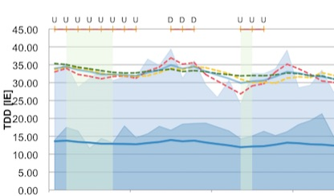

# Graphing Insulin Receptor Up/Down Regulation
Excel worksheet, to track the state of Insulin Receptor Up/Down Regulation of a T1D using a weighted running average (Reference TDD) over the last 14 days.

<table>
 <tr><td width="50%">
 
  </td>
  <td>
   <ul><li>  light blue area = TDD, darker blue area = total basal insulin per day. 
   </li><li> dashed Lines: red/blue/green = 3/7/14 day moving avg. 
   </li><li> solid lines: Light blue = reference TDD, darker blue = reference Basal calculated from that by applying an individuall percentage to the reference TDD. 
    </li><li>light green background: non-working days</li>
    </ul>
   horizontal scale: time-series with a one-day resolution
</td></tr></table>

## ToDo: explain receptor up/down regulation. 
For a start: The general lay of your insulin sensitivity depends on the *amount* of insulin the body is “used to”. 
**Receptor Down Regulation**:  Using more insulin over a consecutive number of days, regardless of the reason (sickness,  medication, less sport, multi-day-feasting, whatever), de-sensitizes your reaction to insulin in general,  i.e. an increased **Insulin Resistance**.
**Receptor Up Regulation**: This can be reversed by using less insulin over a consecutive number of days - more activity, less carbs, etc. 

## Getting started with the worksheet
The first 14 days are needed to get the weighted average calculation up and running with valid data.
* In **[Data]17B** you enter the Date of the first day of your series of TDD data (Total daily insulin, meaning *all* insulin injected during that day, basal, bolus (meal bolus *and*  correction bolus).
* you then enter  the **first 14 days of TDD** into Column **J** to get the weighted average calculations initialized

### Daily entries:
Starting **line 31** in the “data” sheet, you enter 
* **J** Total daily insulin - as collected from the pump (ICT users can change this to a calculation adding data from the bolus and basal columns). This is the only column *needed* for the sheet to work.
* **I** Sum of Basal Insulin (either from profile,  or  -better- taking TBR  into account, from nightscout)
* **H** (optional) sum of corrective bolus insulin (hard to isolate in closed loop setups)
* **Q** (up to two) single letter Events affecting the TDD or your interptretation (Set change, Illness, whatever is relevant to you). In the samples, K is used for set change, D/U for interpretation as Up or Down indicator according to a ruleset published by Dr. Teupe.
* **G** (optional) Bolus insulin , currently disabled from graph. 
* **A** used to mark non-working days in the graph (could be used for training days, whatever *you* want to stand out): 0: Day is displayed with a green background in the graph. Not relevant for calculations

## Bibliography
[Die Logik meines Diabetes](http://www.diabetesdorfalthausen.de/praxis/Content/buch.php) : [Insulinpumpen-Therapiewissen; Behandlung diabetischer Fußleiden; 30Jahre Erfahrung als Handbuch] / Bernhard Teupe. - 1. Aufl..
